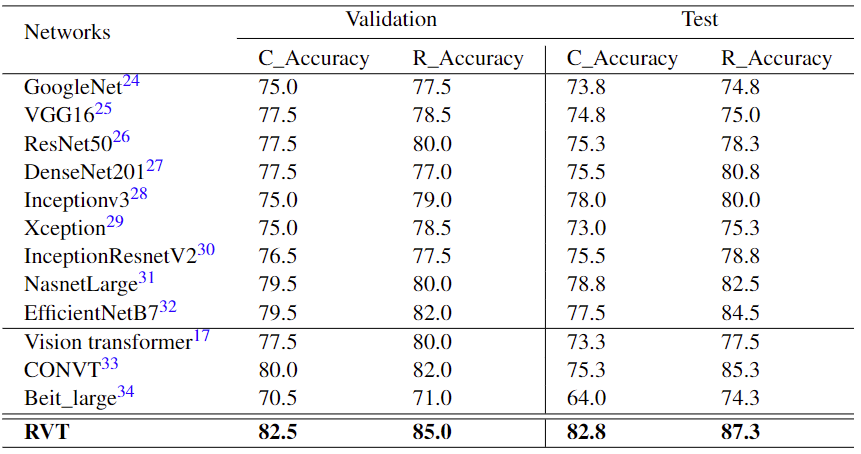
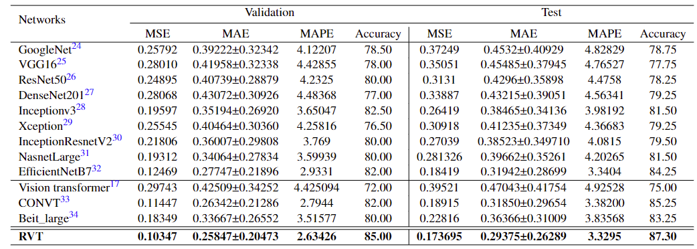
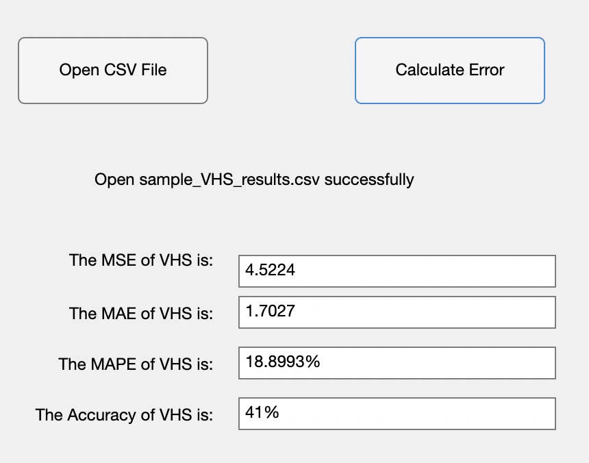

# Dog-Cardiomegaly_VHS


This directory contains the datasets and evaluation methods of VHS for paper [Regressive Vision Transformer for Dog Cardiomegaly Assessment](https://www.nature.com/articles/s41598-023-50063-x), which is accepted by Scientific Reports.


If you have any questions, please email to youshan.zhang@yu.edu
### Reference

If you find it helpful, please cite it as:

`
Li, Jialu, and Youshan Zhang. "Regressive vision transformer for dog cardiomegaly assessment." Scientific Reports 14, no. 1 (2024): 1539.
`


Or in bibtex style:

```

@article{li2024regressive,
  title={Regressive vision transformer for dog cardiomegaly assessment},
  author={Li, Jialu and Zhang, Youshan},
  journal={Scientific Reports},
  volume={14},
  number={1},
  pages={1539},
  year={2024},
  publisher={Nature Publishing Group UK London}
}

```


<p align="center">
   
</p>
<p align="center">Dog Cardiomegaly Assessment Accuracy</p>


<p align="center">
   
</p>
<p align="center">MSE, MAE, MAPE and Accuracy</p>

#### Note, this table contains some re-run experiments that the accuracy might be different from the R_Accuracy in the previous table.

### Usage
1. [Download the labeled training, validation, and unlabeled test dataset here.](https://yuad-my.sharepoint.com/:f:/g/personal/youshan_zhang_yu_edu/ErguFJBE4y9KqzEdWWNlXzMBkTbsBaNX9l856SyvQauwJg?e=hp9bY7) 
2. Train the model with the labeled training dataset and validation dataset
3. Evaluate the test dataset using the software

### Evaluation
To avoid tuning the model based on the test dataset, we also provide an application to automatically evaluate the performance of your prediction.

1. You need to generate your prediction as a CSV file: [image_name, predicted VHS]. We also uploaded a sample_results.csv for your reference.
2. For Windows user, installDog_X-ray_VHS_Windows.exe. You may need to install Matlab R2021b (9.11) MCR [here](https://www.mathworks.com/products/compiler/matlab-runtime.html) (Windows version).

3. For Mac user, unzip Dog_X_ray_classfication_accuracy.zip and then install Dog_X-ray_VHS_Mac.app. You may need to install R2022a (9.12) MCR [here](https://www.mathworks.com/products/compiler/matlab-runtime.html) (Mac version). 


4. Run Cow_teat_classfication_accuracy software to get your prediction accuracy

   I) Click on 'Open CSV File' 
   
   II) Click on 'Calculate Error'
   
   III) You will see the MSE, MAE, MAPE and Accuracy in the text area


<p align="center">
   
</p>
<p align="center">Sample Dog Cardiomegaly VHS Measurement Results</p>


